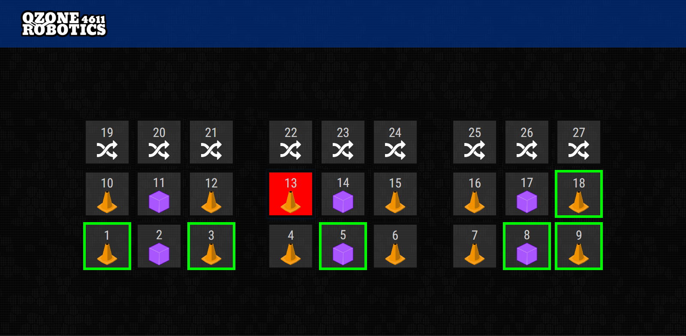

# ChargedUp Auto Dashboard

This dashboard was created for the 2023 FRC season. The team was prototyping a system in which during the match, the driver could hold down a button and the robot would autonomously drive to and align with one of the scoring locations.

This dashboard allows the auxillary driver to select a scoring location for the robot to drive to.
 
 

The location that is currently selected is highlighted red. This information is sent over NetworkTables to the robot.

The locations in which the robot has already placed a game piece are given a green border. This information is received from the robot over NetworkTables.